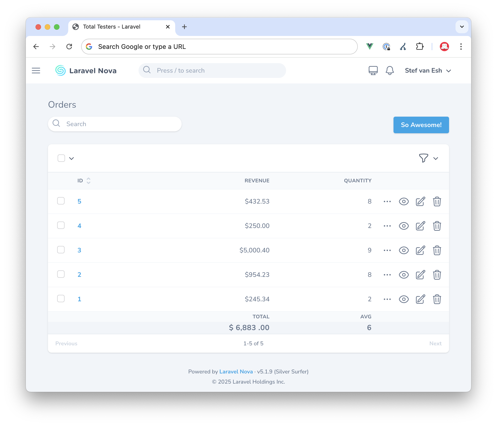

# Laravel Nova Totals Footer

[](https://packagist.org/packages/marshmallow/nova-totals-footer)
[](https://github.com/marshmallow-packages/nova-totals-footer/actions/workflows/tests.yml)
[](https://packagist.org/packages/marshmallow/nova-totals-footer)

This [Laravel Nova](https://nova.laravel.com) package adds a totals footer to your resource index tables, calculating the total of any columns you choose.

## Screenshot



## Requirements

- `php: ^8.1`
- `laravel/nova: ^5.0`

## Installation

Install the package via Composer:

```bash
composer require marshmallow/nova-totals-footer
```

The package is a Nova tool and is auto-discovered — no further registration is needed.

## Usage

To include a field in the table footer, call its `calculate()` method and describe the calculation. The available methods are `sum`, `count`, `avg`, `min` and `max`:

```php
use Laravel\Nova\Fields\Currency;

Currency::make('Revenue', 'revenue')
    ->required()

    /** 👇 This is where the magic happens */
    ->calculate(
        method: 'sum',     // sum, count, avg, min, max
        title: 'Total',
        prefix: '$',
        postfix: '.00',
        hideTitle: true,   // true, false (default)
        align: 'right',    // left, right (default), center
        titleAlign: 'right', // left, right (default), center
        decimals: 2,       // number of decimals to format the total with (default: 0)
    ),
```

> When the resource is shown through a relationship (e.g. a `HasMany` field on
> another resource), the footer totals are calculated over the **related**
> records only, matching the rows in the table.

### Hide the footer header

Sometimes you don't want the extra title row above the totals. You can hide it:

```php
use Marshmallow\NovaTotalsFooter\NovaTotalsFooter;

NovaTotalsFooter::hideHeader();
```

### Static analysis (PHPStan / Larastan)

`calculate()` is a runtime macro on Nova's `Field`, so static analysers don't know about it by default. Register the shipped stub in your `phpstan.neon` so it's recognised (no more `@phpstan-ignore` on every call):

```neon
parameters:
    stubFiles:
        - vendor/marshmallow/nova-totals-footer/stubs/calculate-macro.stub
```

## Testing

The package ships a [Pest](https://pestphp.com) + [Orchestra Testbench](https://github.com/orchestral/testbench) suite. Nova is a private dependency, so configure your credentials before installing:

```bash
composer config http-basic.nova.laravel.com "your-email" "your-license-key"
composer install
composer test
```

CI (`.github/workflows/tests.yml`) runs the suite against PHP 8.2–8.4 and expects `NOVA_USERNAME` and `NOVA_LICENSE_KEY` repository secrets.

## Contributing

Feel free to suggest changes, ask for new features or fix bugs yourself. We're sure there are still a lot of improvements that could be made, and we would be very happy to merge useful pull requests.

## Security Vulnerabilities

Please report security vulnerabilities by email to [hello@marshmallow.nl](mailto:hello@marshmallow.nl) rather than via the public issue tracker.

## Credits

- [All Contributors](https://github.com/marshmallow-packages/nova-totals-footer/contributors)

## License

The MIT License (MIT). Please see the [License File](LICENCE) for more information.

## 💖 Sponsorships

If you are reliant on this package in your production applications, consider [sponsoring us](https://github.com/sponsors/marshmallow-packages)! It is the best way to help us keep doing what we love to do: making great open source software.

## Made with ❤️ for open source

At [Marshmallow](https://marshmallow.nl) we use a lot of open source software as part of our daily work. So when we have an opportunity to give something back, we're super excited!

We hope you will enjoy this small contribution from us and would love to [hear from you](mailto:hello@marshmallow.nl) if you find it useful in your projects. Follow us on [Twitter](https://x.com/marshmallow_dev) for more updates!
